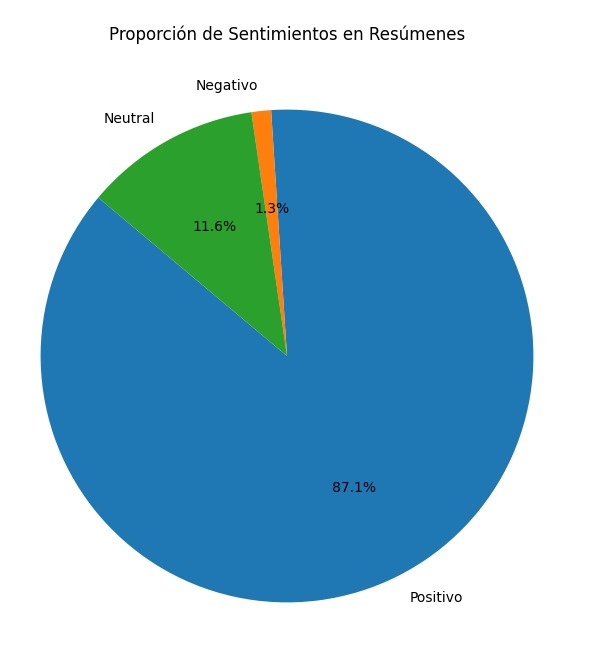

# Análisis de Sentimientos con Google Cloud NLP

Este proyecto implementa un sistema de análisis de sentimientos utilizando la API de Google Cloud Natural Language Processing (NLP). Se clasifica el sentimiento de textos en **positivo**, **negativo** o **neutral** basado en el contenido de las columnas de un archivo Excel contenido de Titulo y su Resumen.


## Descripción del Proyecto

Este proyecto incluye un conjunto de scripts y herramientas diseñados para realizar [insertar descripción breve del propósito del proyecto, e.g., análisis de datos, procesamiento de imágenes, etc.].

El proyecto se distribuye como un archivo **comprimido** que contiene:

1. **Código fuente**: Scripts en Python organizados en carpetas para facilitar la ejecución y el mantenimiento.
2. **Dependencias**: Un archivo `requirements.txt` que lista las librerías necesarias para ejecutar el proyecto.
3. **Archivo de credenciales de Google Cloud**: Un archivo `JSON` con las claves necesarias para acceder a los servicios de Google Cloud requeridos por el proyecto (como almacenamiento, bases de datos o APIs).

### Características principales:
- **Uso de Google Cloud NLP:** Análisis preciso de sentimientos utilizando la tecnología de Google.
- **Procesamiento directo del texto:** Sin limpieza previa para respetar el contexto y significado completo del contenido.
- **Visualización de resultados:** Generación de tablas y gráficos que resumen el análisis.
- **Resultados exportados:** Resultados clasificados exportados a un archivo Excel.

### Entrada y Salida:
- **Entrada:** Archivo Excel con dos columnas: `Titular` y `Resumen`.
- **Salida:** Archivo Excel con columnas adicionales:
  - `Sentimiento_Titular`: Clasificación del sentimiento del titular (Positivo, Negativo o Neutral).
  - `Sentimiento_Resumen`: Clasificación del sentimiento del resumen (Positivo, Negativo o Neutral).

---

### Nota Importante sobre las Credenciales

El archivo JSON de credenciales de Google Cloud es esencial para la ejecución del proyecto, ya que proporciona acceso a los servicios configurados en la plataforma. Asegúrate de:

1. **Mantener este archivo en un lugar seguro**.
2. **No subirlo a repositorios públicos** para evitar comprometer tus credenciales.
3. Si es necesario compartir el proyecto, elimina o reemplaza las credenciales con un archivo de ejemplo.

---

### Uso del Archivo JSON

El archivo JSON debe estar ubicado en la raíz del proyecto o en una ubicación definida en las configuraciones del script. Asegúrate de configurar las variables de entorno o las rutas necesarias antes de ejecutar el código.

---

### Cómo Descomprimir el Proyecto

Para utilizar el proyecto, sigue estos pasos:
1. Descarga el archivo comprimido.
2. Descomprime el archivo utilizando herramientas como **WinRAR**, **7-Zip** o el comando `unzip` en la terminal.
3. Navega al directorio descomprimido y sigue las instrucciones del archivo `README.md` para configurar y ejecutar el proyecto.


---

## Estructura del Proyecto

La estructura del proyecto es la siguiente:


## Instalación y Configuración

###NOTA IMPORTANTE 

### Prerrequisitos
- **Python:** Versión 3.8 o superior.
- **Google Cloud Account:** Con credenciales configuradas para acceder a la API de NLP.
- **Entorno virtual recomendado:** Para evitar conflictos de dependencias.

### Pasos de Instalación
El proyecto puede configurarse utilizando un entorno virtual con **Anaconda** o directamente con **Python**. A continuación, se detallan los comandos para cada opción.
1. **Crear y activar un entorno virtual en Conda**
   ```bash
   conda create -n analisis_sentimiento_env python=3.8
   conda activate analisis_sentimiento_env
   
2. **Crear y activar un entorno virtual con Python (cmd o Powershell)**
   ```bash
   python -m venv analisis_sentimiento_env
3. **Activa el entorno virtual en conda:**
	```bash
	 conda activate analisis_sentimiento_env
4. **Activa el entorno virtual en Python:**
	```bash
	 analisis_sentimiento_env\Scripts\activate
4. **Instalar las dependencias:**
   ```bash
	 pip install -r requirements.txt
5. **Ejecutar el análisis de sentimientos:**
   ```bash
	 python -m src.main
6. **Visualizar los resultados:**
	```bash
	 python -m src.visualization	
## Muestra de los resultados
  
### Tabla:

| **Categoría** | **Titulares** | **Resúmenes** |
|---------------|---------------|---------------|
| **Positivos** | 528           | 542           |
| **Negativos** | 20            | 8             |
| **Neutrales** | 74            | 72            |
	
### Graficos:



